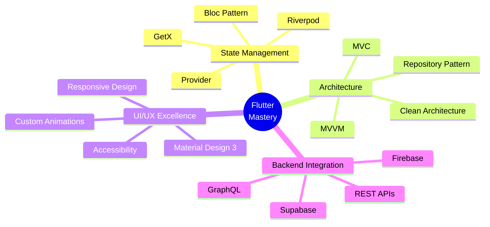

# 👋 Hey there! I'm Megha Prabath
 
<div align="center">
  
</div>
 
<div align="center">
  
</div>
 
## 🚀 About Me
 
```dart
class DeveloperProfile {
  final String name = "Megha Prabath";
  final String role = "Senior Flutter Developer";
  final int experience = 7; // years
  final String location = "Sri Lanka 🇱🇰";
  
  List<String> currentFocus = [
    "Advanced Flutter Architecture",
    "Cross-Platform Development",
    "Performance Optimization",
    "Custom Widget Development"
  ];
  
  List<String> techStack = [
    "Flutter", "Dart", "Firebase",
    "REST APIs", "State Management",
    "Native Android", "iOS Development"
  ];
}
```
 

 
### 🔥 What I'm Up To
 
- 🚀 **Currently Building:** Innovative mobile applications with cutting-edge Flutter features
- 📚 **Learning:** Advanced Flutter patterns, Riverpod, and Clean Architecture
- 🤝 **Open to Collaborate:** Mobile app projects using Flutter & cross-platform solutions
- ✍️ **Expertise:** Flutter widgets, app architecture, and mobile performance optimization
- 💡 **Ask Me About:** Flutter development, state management, and mobile UI/UX best practices
 
### 📫 Let's Connect!
 
<div align="center">
 
[](mailto:megha.prabath@gmail.com)
[](https://linkedin.com/in/meghaprabath)
[](https://twitter.com/meghaprabath)
[](https://meghaprabath.dev)
[](https://instagram.com/meghaprabath)
 
</div>

---

## 💻 Tech Stack

<div align="center">

### 📱 Mobile Development


### 🎨 UI/UX & Design


### ☁️ Backend & Database


### 🛠️ Tools & Platforms


</div>

---

## 📊 GitHub Analytics
 
<div align="center">
  
  
</div>
 
<div align="center">
  
</div>

## 🏆 GitHub Trophies
 
<div align="center">
  
</div>
 
## 📈 Contribution Graph
 
<div align="center">
  
</div>

---

## 🎯 Current Focus Areas
 
<div align="center">
 

 
</div>
 
## 💡 Fun Developer Fact
 
> 💻 **Did You Know?** Flutter was originally called "Sky" and was designed to run at a consistent 120fps! With 7 years of experience, I've witnessed Flutter's evolution from its early days to becoming the powerhouse cross-platform framework it is today. From Sky to Flutter 3.0+ - what an incredible journey! 🚀✨
 
## 🔥 Recent Activity
 
<!--START_SECTION:activity-->
<!--END_SECTION:activity-->

---
 
<div align="center">
  
### 🌟 "Code is like humor. When you have to explain it, it's bad." - Cory House
 

 
**Thanks for visiting! Let's build something amazing together! 🚀**
 
</div>
 
<!--
**Profile Views Counter**
-->
<div align="center">
  
</div>
